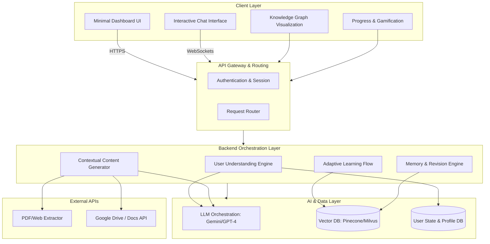

# Adaptive Learning Companion: System Architecture & Design

## 1. System Architecture Diagram (Textual)



## 2. UI Layout Wireframe (Text)

```text
+-----------------------------------------------------------------------------+
|  [Logo] AdaptiveLearn     |  🔥 Streak: 12 Days  |  🏆 Level 5: Scholar     |
+---------------------------+----------------------+--------------------------+
|                           |                                                 |
|  +---------------------+  |  +-------------------------------------------+  |
|  | 🎯 CURRENT GOAL     |  |  | 🤖 AI TUTOR CHAT                        |  |
|  | "Learn Python in 7  |  |  |-----------------------------------------|  |
|  |  Days"              |  |  |                                         |  |
|  | [===--------] 25%   |  |  | AI: Let's tackle "For Loops". A for     |  |
|  +---------------------+  |  | loop is like a conveyer belt...         |  |
|                           |  |                                         |  |
|  +---------------------+  |  | User: What if I want to skip an item?   |  |
|  | 🧠 KNOWLEDGE GRAPH  |  |  |                                         |  |
|  | (Visual Nodes)      |  |  | AI: Great question! You use `continue`. |  |
|  | • Variables (100%)  |  |  | Let's try a quick 1-line coding quiz.   |  |
|  | • Loops (40%)       |  |  |                                         |  |
|  | • Functions (0%)    |  |  |-----------------------------------------|  |
|  +---------------------+  |  | [ Toggle: Explain Mode | Challenge Mode]|  |
|                           |  | > Type your answer or upload a PDF...   |  |
|  +---------------------+  |  | [ Upload ] [ Mic ]           [ Send ]   |  |
|  | 📅 DAILY REVISION   |  |  +-------------------------------------------+  |
|  | 3 Weak Concepts Due |  |                                                 |
|  +---------------------+  |                                                 |
+-----------------------------------------------------------------------------+
```

## 3. Core Modules Explained

### A. User Understanding Engine
**Function:** The "brain" tracking the learner. It calculates a rolling "Comprehension Score" (0-100) for every micro-concept based on response accuracy and hesitation (typing delay or prompt frequency).
**Innovation:** Dynamically updates a Neo4j-style Knowledge Graph. If you fail "React Hooks", it automatically flags the prerequisite "JS Closures" as a weak point.

### B. Adaptive Learning Flow
**Function:** The pedagogical router. 
**Innovation:** Implements the "Interactive Learning Loop". If it detects confusion (e.g., user asks "I don't get it" twice), it triggers the **Confusion Detection AI**, instantly switching the prompt style from "Technical" to "Explain Like I'm 5 (ELI5)" using real-world analogies.

### C. Contextual Content Generator (RAG Pipeline)
**Function:** Ingests PDFs or web links and converts them into micro-lessons.
**Innovation:** Uses Retrieval-Augmented Generation (RAG). Instead of summarizing a whole 50-page PDF, it extracts chunks, creates 5 flashcards, 2 quizzes, and 1 scenario-based question, feeding them to the user one by one.

### D. Memory + Revision Engine
**Function:** Implements SuperMemo/Anki spaced repetition algorithms.
**Innovation:** Calculates the optimal forgetting curve. When a user logs in, the "Daily Revision" pulls vectors from the database that are on the verge of being forgotten and generates brand-new context-aware questions (avoiding exact repetition).

## 4. Sample Interaction Flow

**Scenario: User is learning "Object-Oriented Programming" (OOP) in Python.**

1. **System (Teach):** "OOP is like building with Lego blocks. You create a blueprint (Class) and make specific objects from it. Ready for an example?"
2. **User:** "Yes, show me."
3. **System (Code Modal):** Shows a simple `Car` class. "Now, how would you create a red Ferrari using this class?"
4. **User (Mistake):** `Ferrari = new Car("red")`
5. **System (Evaluate & Adapt):** *Detects Javascript syntax instead of Python.* "Close! That's how you do it in JavaScript. In Python, we don't use the `new` keyword. Try again!"
6. **User (Success):** `ferrari = Car("red")`
7. **System (Gamify):** "Spot on! 🎯 +10XP. Let's increase the difficulty. How would you make the car accelerate?" *(Switches to Challenge Mode)*.

## 5. Example API Structure (REST & GraphQL)

```json
// POST /api/v1/learning/interact
// Request from Frontend
{
  "user_id": "usr_987",
  "session_id": "sess_123",
  "current_topic": "python_oop",
  "user_input": "Ferrari = new Car(\"red\")",
  "mode": "challenge",
  "metrics": {
    "response_time_ms": 4500,
    "backspaces": 2
  }
}

// Response from Backend
{
  "status": "success",
  "feedback_type": "correction",
  "detected_confusion": "cross_language_syntax",
  "ai_response": {
    "text": "Close! That's JavaScript syntax. In Python, we drop the `new` keyword.",
    "action": "retry_prompt",
    "difficulty_adjusted": -0.1
  },
  "gamification": {
    "streak_active": true,
    "xp_gained": 0
  },
  "knowledge_graph_updates": [
    {"concept": "python_instantiation", "confidence": 0.4}
  ]
}
```

## Tech Stack Recommendation for Hackathon
- **Frontend:** Next.js (React), TailwindCSS, Framer Motion (animations).
- **Backend:** Python (FastAPI) or Node.js.
- **LLM Layer:** LangChain + Google Gemini Pro (fast reasoning).
- **Vector DB:** Pinecone (free tier is perfect for hackathons).
- **Database:** Supabase (PostgreSQL).
